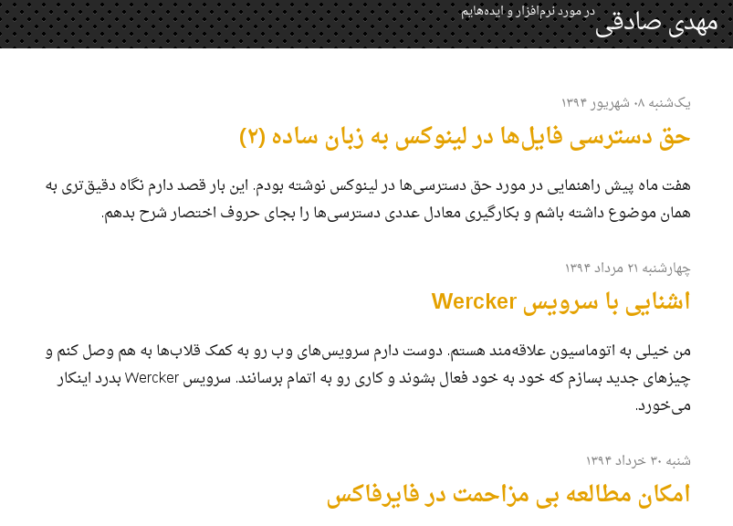

# jekyll-theme-mehdix-rtl [](https://badge.fury.io/rb/jekyll-theme-mehdix-rtl)



This is the jekyll theme used for my personal Persian [website](http://mehdix.ir). Persian aka Farsi is written right-to-left, however some people use Roman script to write Persian language in messaging applications and social networks.

During the last few years people have reached out to me asking how to setup a persian Jekyll website with Jalali calendar support. Since Jekyll now supports themes, I created this theme based on my website to help others to bootstrap their own websites.

This repository can be of use to anybody willing to build a new right to left website. I gradually fix issues which I came across while writing new posts in my website. This website is produced using [Jekyll](http://jekyllrb.com/) static site generator.

# Make it yours
Take the following steps to make your own website based on this theme:

  1. Fork the repository
  2. Edit CNAME file and replace its content with your domain name
  3. [Add an A record](https://help.github.com/articles/tips-for-configuring-an-a-record-with-your-dns-provider/) with your DNS provider to point to Github nameservers (otherwise your website would be only reachable under
  *username.github.io* or *username.github.io/repository_name*).
  4. Edit _config.yml to reflect your information
  5. Move _posts/* contents to _drafts/* or delete them (you can use them as template)
  6. Edit _includes/footer.html and edit feedburner and validation links. Alternatively
    you can delete any link that you don't like. To use feedburner you have to setup an
    account there for your website.
  7. Write your awesome stories :heart:

  ## Important note
  In order to [build](http://mehdix.ir/jekyll-structure.html) the website correctly, you have to 
  name the forked repository different from your username. If you put it under a repository like *yourusername.github.io* Github will use its own Jekyll builder to build your website, no matter what you put inside *gh-pages* branch. Happy writing!
## Installation

Add this line to your Jekyll site's Gemfile:

```ruby
gem "mehdix-rtl"
```

And add this line to your Jekyll site's `_config.yml`:

```yaml
theme: jekyll-theme-mehdix-rtl
```

And then execute:

    $ bundle

Or install it yourself as:

    $ gem install jekyll-theme-mehdix-rtl

## Usage

TODO: Write usage instructions here. Describe your available layouts, includes, and/or sass.


## Development

To set up your environment to develop this theme, run `bundle install`.

Your theme is setup just like a normal Jekyll site! To test your theme, run `bundle exec jekyll serve` and open your browser at `http://localhost:4000`. This starts a Jekyll server using your theme. Add pages, documents, data, etc. like normal to test your theme's contents. As you make modifications to your theme and to your content, your site will regenerate and you should see the changes in the browser after a refresh, just like normal.

When your theme is released, only the files in `_layouts`, `_includes`, and `_sass` tracked with Git will be released.

## License

[MIT](http://opensource.org/licenses/MIT).
