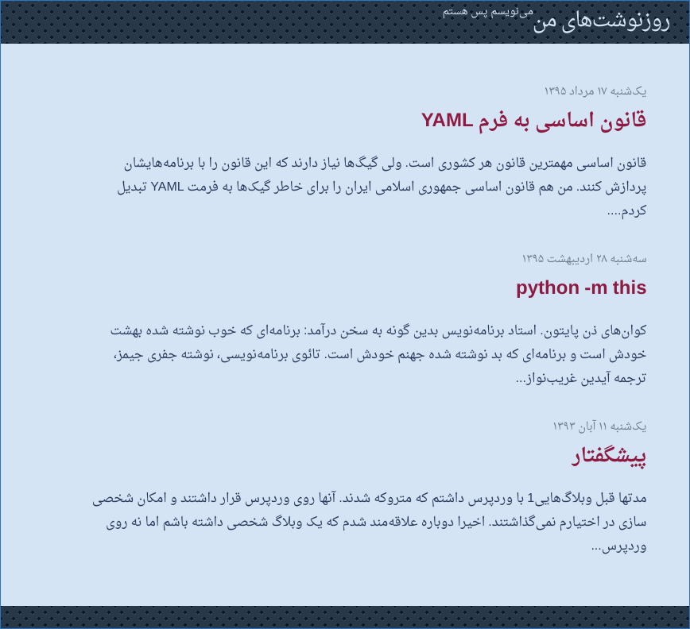

# jekyll-theme-mehdix-rtl [](https://badge.fury.io/rb/jekyll-theme-mehdix-rtl)
[](https://app.netlify.com/start/deploy?repository=https://github.com/mehdisadeghi/jekyll-theme-mehdix-rtl)



This is the jekyll theme used for my personal Persian [website](http://mehdix.ir). Persian aka Farsi is written right-to-left, however some people use Roman script to write Persian language in messaging applications and social networks.

During the last few years people have reached out to me asking how to setup a persian Jekyll website with Jalali calendar support. Since Jekyll now supports themes, I created this theme based on my website to help others to bootstrap their own websites.

This repository can be of use to anybody willing to build a new right to left website. I gradually fix issues which I came across while writing new posts in my website. This website is produced using [Jekyll](http://jekyllrb.com/) static site generator.

## Installation

Take the following steps to make your own website based on this theme. First of all, create your website if you have not already:


    $ jekyll create mywebsite


Then add this line to your Jekyll site's Gemfile:

```ruby
gem "jekyll-theme-mehdix-rtl"
```

And add this line to your Jekyll site's `_config.yml`:

```yaml
theme: jekyll-theme-mehdix-rtl
```

And then execute:

    $ bundle

Or install it yourself as:

    $ gem install jekyll-theme-mehdix-rtl

You can override theme style by creating matching files with the same structure inside your Jekyll source tree. See Jekyll [Themes docs](https://jekyllrb.com/docs/themes/) for more information on that.

### Enable the Plugins
This theme uses some jekyll plugins. Enable them by adding them to the `plugins` section in the config file:

```yaml
plugins:
  - jekyll-jalali
  - jekyll-sitemap
  - jekyll-paginate
  - jekyll-hinduarabic
  - jekyll-seo-tag
```

## Further customization

### Styles
You can create a `_sass` folder and put a file named `custom.scss` in it. This theme will load it by default.

### Layouts
The following layouts are available for your homepage:
- home: post titles along with an excerpt and pagination
- minimal: only post titles

### Comments
This theme supports three comment systems. First one is disqus.
In order to enalbe disqus comments add `comment_system:disqus` and `disqus_shortname:DISQUS_USERNAME` to your `_config.yml` file.

The second approach is static comments. In order to enable static comments add `comment_system:static` to the config
file. This will load commends from `_data/comments` folder. There should be one YAML file per post. Name of the file
should be the `uuid` of the post (each post must have a `uuid` in its front matter). The following sample defines two
comments for post with `uuid` 0b64d07f-6c08-475b-a509-463df5458039:

```yaml
- date: 20171220
  name: تقی
  email: john@doe.com
  url: https://johndoe.com
  text: >
      نوکرتم دادا!
      کوجایی تو؟

- date: 20171221
  name: تقی ۲
  email: john@doe.com
  url: https://johndoe.com
  text: >
      [۲] دادا خبری نیت ازت
```

For the time being I am using Netlify to handle custom comment forms on each post page and add them to the
comments using the [`netlify_comments.py`](./netlify_comments.py) script.

### Forcing RTL code blocks
If you put code blocks and they appear incorrectly, you can use _Markright gem. First add it to your Gemfile:

```ruby
gem "jekyll-markright"
```

And change your __config.yml_ respectively:

```yaml
markdown: Markright
```

### Footer
If any of the following ids is present in the config a corresponding item will be added to the footer:

- github_username
- twitter_username
- feedburner_id
- email

### Analytics
In order to send pageviews to Google Analytics set your ID in the `_config.yml`: `google_analytics_id: YOUR_ID`


### SEO
Make sure to fill entries in the config file correctly to get a better search engine experience.
Specially fill the SEO section with your Github and Twitter usernames. Don't forget to add `lang`
and `logo` entries. See [`jekyll-seo-tag`](https://github.com/jekyll/jekyll-seo-tag/) for further
information.

## License

[MIT](http://opensource.org/licenses/MIT)

<div dir="rtl" lang="fa">

## در مورد فارسی‌نویسی
در هنگام گزارش مشکلات یا شرح تغییرات، فارسی نوشتن خیلی هم خوب است. فقط یک شرط دارد! متن را درون تگ راست به چپ شده بنویسید که درست نمایش داده بشود. اگر هم دوست دارید انگلیسی بنویسید هیچ اشکالی ندارد.

</div>

    <div dir="rtl" lang="fa">مطلب مورد نظر</div>