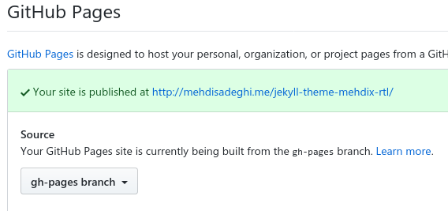

# jekyll-theme-mehdix-rtl [](https://badge.fury.io/rb/jekyll-theme-mehdix-rtl) [](https://app.netlify.com/start/deploy?repository=https://github.com/mehdisadeghi/jekyll-theme-mehdix-rtl)

See English version below.

<div dir="rtl" lang="fa">
این ریپازیتوری حاوی قالبی جکیلی است که برای [وبسایت شخصی](https://mehdix.ir) خودم ساخته‌ام. انگیزه ایجاد آن هم کمک به افرادی است که سعی دارند سایتی شبیه آن برای خودشان بسازند و پاسخ به سوالاتی است که طی سالهای گذشته در مورد نحوه ساخت آن پیوسته دریافت کرده‌ام. در ادامه روش‌های استفاده و سوالات رایج را می‌آورم. در راهنمای انگلیسی هم نحوه نصب را نوشته‌ام.

## نحوه استفاده
این ریپازیتوری را به دو طریق می‌توانید استفاده کنید. روش اول اینست که مستقیما این ریپازیتوری را فورک کنید. روش دوم استفاده از [جم روبی](https://rubygems.org/gems/jekyll-theme-mehdix-rtl) این قالب است. هر دو را شرح می‌دهم.

### استفاده به روش فورک
فورک کنید و بعد کلون کنید و اسم و رسم سایت و محتوا را تغییر بدهید و به عنوان یک سایت جدید استفاده کنید. در این روش باید بعد از فورک در ریپازیتوری جدید داخل اکانت خودتان GitHub Pages را فعال کنید و برنج _gp-pages_ را بعنوان برنچ حاوی سایت استاتیک انتخاب کنید (جایی که خروجی بیلد جکیل قرار دارد).

<p align="center">

</p>

بدون هیچ تغییر دیگری همینکه تغییرات خودتان را پوش کنید سایت بیلد می‌شود. توجه داشته باشید که اگر از دامنه شخصی بجای دامنه‌ی گیتهاب استفاده می‌کنید بخش Patch Jekyll config را از فایل گیت‌هاب اکشنز حذف کنید.

حسن این روش اینست که ساده و سرراست است. لازم نیست با پیچیدگی‌های جکیل و تنظیمات قالب را بدانید. عیبش هم اینست که تغییرات جدید در تم را دریافت نمی‌کند که به نظرم اهمیت چندانی ندارد.

### استفاده از طریق روبی جم
ساختار جکیل بکار رفته در این ریپازیتوری به صورت یک [جم روبی](https://rubygems.org/gems/jekyll-theme-mehdix-rtl) در دسترسی است. در اینصورت باید یک وبسایت جکیل ساخت و در فایل `_config.yml` قالب را تغییر داد. این کاری است که در ریپازیتوری ‏[وبسایت خودم](https://github.com/mehdisadeghi/mehdix.ir/blob/master/_config.yml#L26) انجام داده‌ام. این روش را در شرح انگلیسی نوشته‌ام. 

حسن این روش اینست که می‌توان نسخه‌های جدیدتر تم را به صورت نصب نسخه‌های جدیتر جم روبی دریافت کرد. عیبش آنست که قالب جکیل به صورت تم محدود است. مثلا جکیل صفحه ۴۰۴ را از داخل جم قالب نمی‌خواند، همینطور برخی فایل‌ها مانند فایل‌های تولید فید را. در ضمن باید تمام تنظیمات بیلد سایت را هم جداگانه انجام داد.

## برخی سوالات رایج

1. تقویم شمسی روی گیت‌هاب کار نمی‌کنه. پلاگین‌ها کار نمی‌کنند!

بیلدر پیش‌فرض گیت‌هاب نمی‌تواند این سایت را بیلد کند چون پلاگین‌ها را ندارد. از ‬[تنظیمات بیلد](https://github.com/mehdisadeghi/jekyll-theme-mehdix-rtl/blob/master/.github/workflows/gh-pages.yml) همین وبسایت استفاده کنید که بالاتر شرح دادم.

2. وبسایت اصلا روی گیت‌هاب کار نمی‌کند! گیت‌هاب برنج gh-pages را اصلا برای وبسایت بکار نمی‌برد!

اگر اسم ریپازیتوری همان یوزرنیم شما باشد گیت‌هاب سایت را از برنج مستر خواهد ساخت. گیت‌هاب به این سایت‌ها User page می‌گوید و در غیر اینصورت Project page. روش‌هایی که برای بیلد توضیح دادم فقط برای Project page کار می‌کند. یعنی یوزرنیم و نام ریپازیتوری سایت نباید یکسان باشد. برای یوزرپیج احتمالا باید سورس را در یک برنج غیر از مستر ذخیره کنید و خروجی بیلد وبسایت را پوش کنید در برنج مستر. امتحان نکرده‌ام.

3. کامنت‌های استاتیک کار نمی‌کند!

روی گیت‌هاب اصلا نمی‌شود. من روی نتلیفای این کار را انجام داده‌ام و در [مقاله‌ای](https://mehdix.ir/static-comments.html) روش کار را شرح داده‌ام.

4. چگونه شکل و شمایل صورتی سایت را عوض کنم؟

متغیرهای CSS داخل فایل [`main.scss`](https://github.com/mehdisadeghi/jekyll-theme-mehdix-rtl/blob/master/assets/css/main.scss) را عوض کن.

</div>

## English Guide
This is the jekyll theme used for my personal Persian [website](http://mehdix.ir). Persian aka Farsi is written right-to-left, however some people use Roman script to write Persian language in messaging applications and social networks.

During the last few years people have reached out to me asking how to setup a persian Jekyll website with Jalali calendar support. Since Jekyll now supports themes, I created this theme based on my website to help others to bootstrap their own websites.

This repository can be of use to anybody willing to build a new right to left website. I gradually fix issues which I came across while writing new posts in my website. This website is produced using [Jekyll](http://jekyllrb.com/) static site generator.

## Installation

Take the following steps to make your own website based on this theme. First of all, create your website if you have not already:


    $ jekyll create mywebsite


Then add this line to your Jekyll site's Gemfile:

```ruby
gem "jekyll-theme-mehdix-rtl", "~> 3.0"
```

And add this line to your Jekyll site's `_config.yml`:

```yaml
theme: jekyll-theme-mehdix-rtl
```

And then execute:

    $ bundle install

Or install it yourself as:

    $ gem install jekyll-theme-mehdix-rtl

You can override theme style by creating matching files with the same structure inside your Jekyll source tree. See Jekyll [Themes docs](https://jekyllrb.com/docs/themes/) for more information on that.

## Further customization

### Styles
You can create a `_sass` folder and put a file named `custom.scss` in it. This theme will load it by default.

### Layouts
The following layouts are available for your homepage:
- home: post titles along with an excerpt and pagination
- minimal: only post titles

### Comments
This theme supports three comment systems. First one is disqus.
In order to enalbe disqus comments add `comment_system:disqus` and `disqus_shortname:DISQUS_USERNAME` to your `_config.yml` file.

The second approach is static comments. In order to enable static comments add `comment_system:static` to the config
file. This will load commends from `_data/comments` folder. There should be one YAML file per post. Name of the file
should be the `uuid` of the post (each post must have a `uuid` in its front matter). The following sample defines two
comments for post with `uuid` 0b64d07f-6c08-475b-a509-463df5458039:

```yaml
- date: 20171220
  name: تقی
  email: john@doe.com
  url: https://johndoe.com
  text: >
      نوکرتم دادا!
      کوجایی تو؟

- date: 20171221
  name: تقی ۲
  email: john@doe.com
  url: https://johndoe.com
  text: >
      [۲] دادا خبری نیت ازت
```

For the time being I am using Netlify to handle custom comment forms on each post page and add them to the
comments using the [`netlify_comments.py`](./netlify_comments.py) script.

### Forcing RTL code blocks
If you put code blocks and they appear incorrectly, you can use _Markright_ gem. First add it to your Gemfile:

```ruby
gem "jekyll-markright"
```

And change your _config.yml_ respectively:

```yaml
markdown: Markright
```
### Footer
If any of the following ids is present in the config a corresponding item will be added to the footer:

- github_username
- twitter_username
- feedburner_id
- email

### Analytics
In order to send pageviews to Google Analytics set your ID in the `_config.yml`: `google_analytics_id: YOUR_ID`


### SEO
Make sure to fill entries in the config file correctly to get a better search engine experience.
Specially fill the SEO section with your Github and Twitter usernames. Don't forget to add `lang`
and `logo` entries. See [`jekyll-seo-tag`](https://github.com/jekyll/jekyll-seo-tag/) for further
information.

## License

[MIT](http://opensource.org/licenses/MIT)

<div dir="rtl" lang="fa">

## در مورد فارسی‌نویسی
در هنگام گزارش مشکلات یا شرح تغییرات، فارسی نوشتن خیلی هم خوب است. فقط یک شرط دارد! متن را درون تگ راست به چپ شده بنویسید که درست نمایش داده بشود. اگر هم دوست دارید انگلیسی بنویسید هیچ اشکالی ندارد.

</div>

    <div dir="rtl" lang="fa">مطلب مورد نظر</div>
